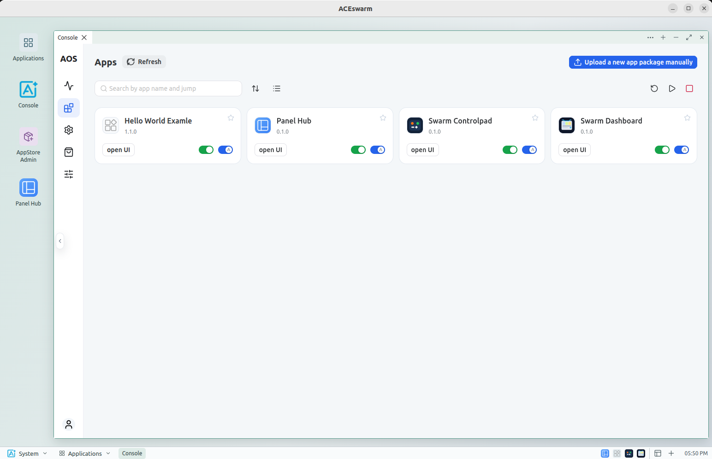

# ACEswarm

ACEswarm is a ground-station workbench for **A**gent-driven **C**ontinuous **E**volution of distributed robot swarms. 
It provides a local application gateway, a local AppStore, and a runtime environment for bundled applications, suitable for both development and deployment. 



## Download

Download the Linux x86_64 AppImage (tested on Ubuntu 22.04; higher versions should work):

- [Nightly AppImage](https://github.com/shupx/ACEswarm/releases/nightly): latest development build, automatically rebuilt at 02:00 Asia/Shanghai when the source has changed since the last successful build.
- [Latest stable release](https://github.com/shupx/ACEswarm/releases/latest): download the AppImage from the release's **Assets** section. This link becomes available once a stable release is published.

The commands below assume the downloaded file is named `ACEswarm-x86_64.AppImage`; substitute its actual filename.

## Run

```bash
chmod +x ACEswarm-x86_64.AppImage
./ACEswarm-x86_64.AppImage
```

You can also enable “Allow executing file as a program” in the file manager and double-click the AppImage.

The AppImage includes the Python runtime, AivudaOS, AivudaAppStore, the local application gateway, and the bundled applications. No separate Python, pip, FastAPI, Uvicorn, AivudaOS, AivudaAppStore, or Caddy installation is required.

On first launch, ACEswarm starts its local services, publishes the bundled applications to the local AppStore, imports the bundled AivudaOS configuration, and opens the workbench. First launch can take longer than subsequent launches.

The taskbar **Downloads** button shows download progress and completion, with actions to open saved files or show them in their folder. Each window has a **Reload** icon at the top right for its selected tab.

### add to system menu

To add ACEswarm to your system menu, use [Appimagelauncher-amd64](https://github.com/TheAssassin/AppImageLauncher/releases/download/v3.0.0-beta-3/appimagelauncher_3.0.0-beta-2-gha287.96cb937_amd64.deb) or [AppImageLauncher-arm64](https://github.com/TheAssassin/AppImageLauncher/releases/download/v3.0.0-beta-3/appimagelauncher_3.0.0-beta-2-gha287.96cb937_arm64.deb):

```bash
sudo dpkg -i appimagelauncher_3.0.0-beta-2-gha287.96cb937_amd64.deb
```

After installation, double-click the AppImage and select `integrate and run` to add it to your system menu.


## User data

The default user workspace is:

```text
~/ACEswarm_ws/
```

To use another workspace:

```bash
ACESWARM_WS_ROOT=/path/to/ACEswarm_ws ./ACEswarm-x86_64.AppImage
```

It contains local service data, installed applications, projects, experiments, logs, and bootstrap state. The AppImage itself remains read-only.

Electron also keeps browser data separately from the workspace. On Linux the default location is:

```text
~/.config/aceswarm/
```

This directory contains the Electron browser cache, cookies, local storage, IndexedDB, and the persistent `persist:aceswarm` WebView session. 
To clear Electron browser cache:

```bash
rm -r ~/.config/aceswarm/
```

If your system uses a custom `XDG_CONFIG_HOME`, replace `~/.config` with `$XDG_CONFIG_HOME`. Clearing these directories removes browser cache, cookies, local storage, and WebView login state; it does not remove installed apps, projects, experiments, or service data in `~/ACEswarm_ws`.

## Uninstall

ACEswarm is distributed as an AppImage and does not require a system installer. Remove the downloaded AppImage:

```bash
rm ACEswarm-x86_64.AppImage
```

Removing the AppImage does not remove user data. To remove the workspace as well, after backing up anything you need:

```bash
rm -rf ~/ACEswarm_ws
```

This permanently removes projects, experiments, installed applications, logs, and local service data.


## MCP Servers and skills

Start ACEswarm, then configure your agent to connect to its three Streamable HTTP MCP servers:

```json
{
  "mcpServers": {
    "aceswarm-playwright": {"url": "http://127.0.0.1:28792/mcp"},
    "aceswarm-aivudaos": {"url": "http://127.0.0.1:28794/mcp"},
    "aceswarm-aivudaappstore": {"url": "http://127.0.0.1:28795/mcp"}
  }
}
```

or add in `.codex/config.toml`:

```toml
[mcp_servers.aceswarm-playwright]
url = "http://127.0.0.1:28792/mcp"

[mcp_servers.aceswarm-aivudaos]
url = "http://127.0.0.1:28794/mcp"

[mcp_servers.aceswarm-aivudaappstore]
url = "http://127.0.0.1:28795/mcp"
```

[MCP server details](docs_dev/mcp-server.md).

Skills are in [aceswarm-skills](aceswarm-skills/). You can clone the repository and link the skills to your agent's skills directory:

```bash
git clone https://github.com/shupx/ACEswarm.git
mkdir -p ~/.agents/skills
ln -sfn "$PWD"/ACEswarm/aceswarm-skills/aceswarm-skills/* ~/.agents/skills/
```

## Developer documentation

Development, architecture, runtime, bootstrap, build, and release documentation is in [`docs_dev/`](docs_dev/).
